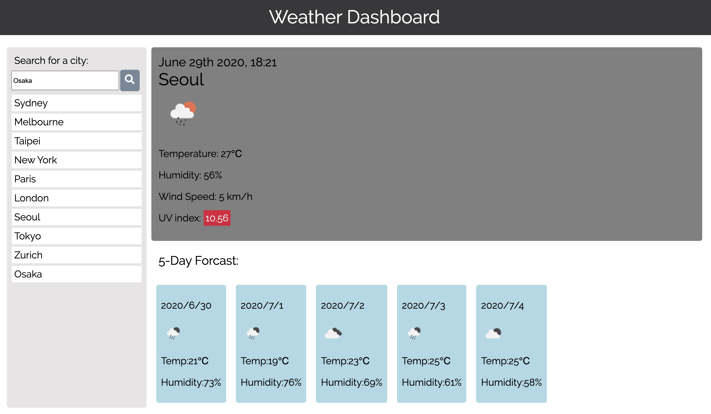

# homework6: Weather forecast
This is a weather forecast including forecast for the day and the future 5 days.

## Description
This is a weather dashboard including forecast for the day and the future 5 days.

## Deployed application
https://roukell.github.io/weather_dashboard/

## Technologies used
HTML, CSS, JavaScript, JQuery, Moment.js, weather API

## Instruction
1. Open the application [here](https://roukell.github.io/weather_dashboard/)
2. Sydney is the default city that will first appear on your page.

3. To search other cities, type in a city name and then click search.
   (Only type in valid city name)

4. The forecast of the city will appear on the page.

5. All enetered cities will be stored in local storage.

 ## Contributing
  The app is contributed by Melody Lo.

## Questions
  * If you have any questions, feel free to contact me via email: yiling.melody.lo@gmail.com
  * My GitHub profile: https://github.com/roukell
